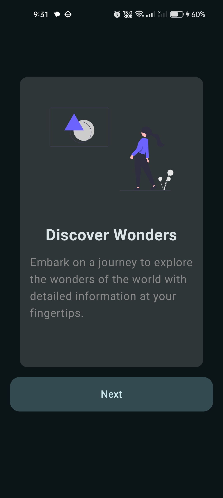
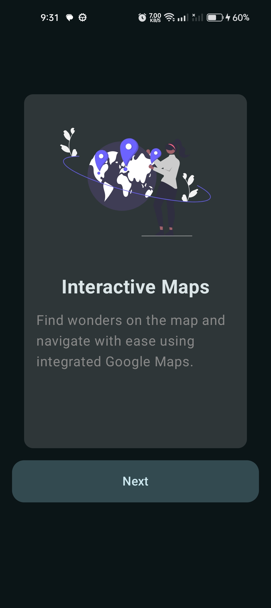
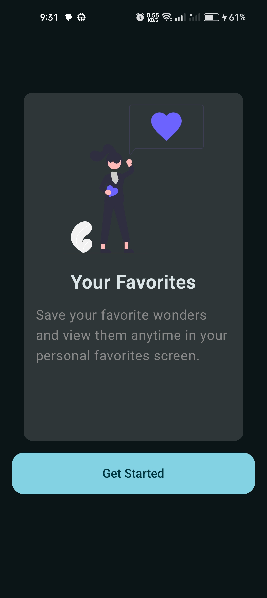
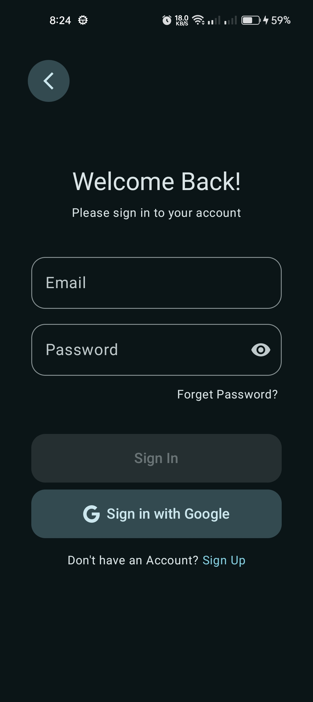
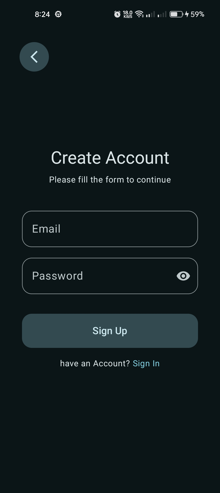
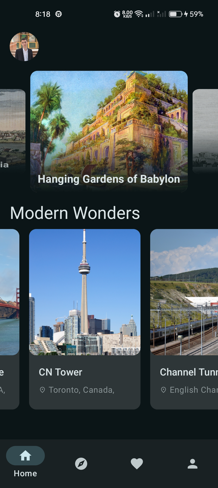
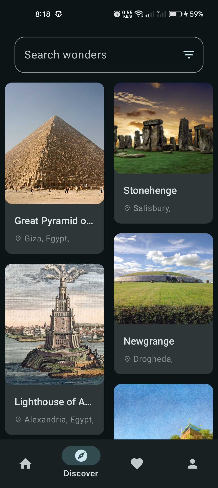
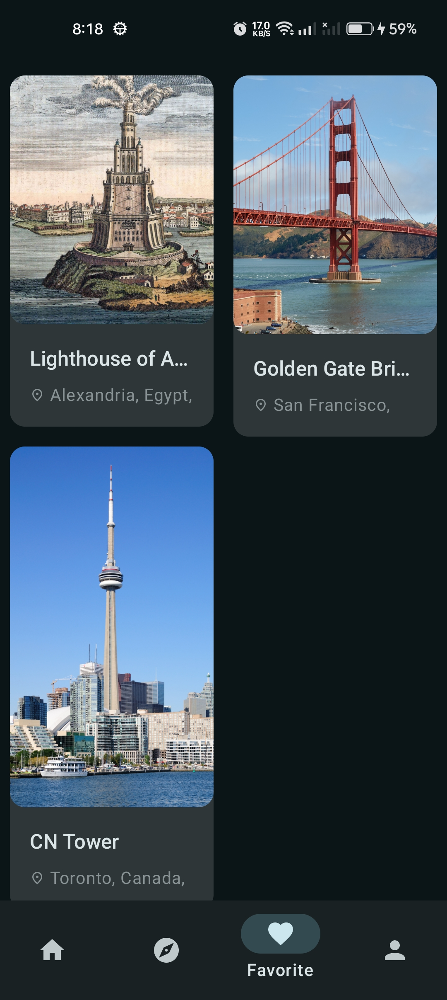
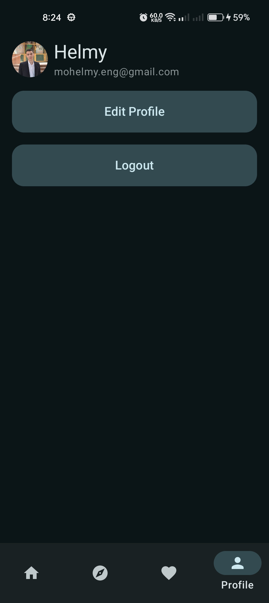
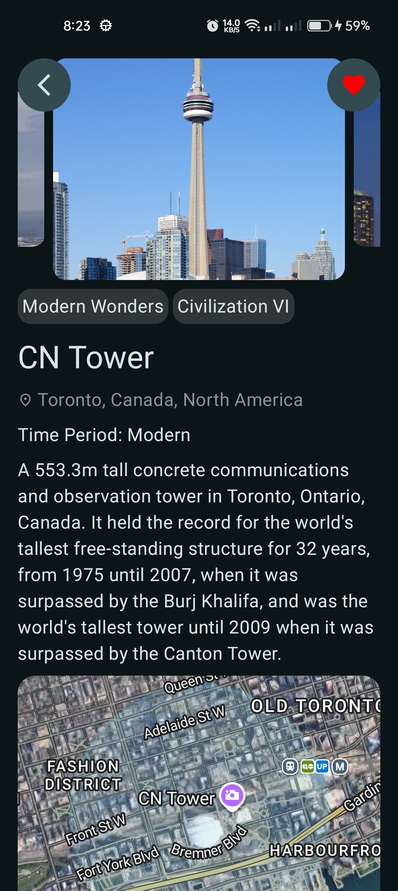

# WanderPedia

**WanderPedia**is an Android app designed to showcase the wonders of the world, offering users a
robust and immersive experience for exploration and discovery. The app integrates advanced features
like interactive maps, personalized user profiles, and a favorites screen to enhance usability and
engagement.

---

## Features

### Explore Wonders of the World

- View detailed information about the world’s wonders, powered by the[World Wonders API
  ](https://www.world-wonders-api.org/v0/docs#tag/default/get/v0/wonders/).

### Discover Feature

- Search and filter wonders based on user preferences.
- Explore wonders through a visually appealing grid layout.

### Detail Screen

- Access comprehensive details about each wonder.
- View locations on the map using**Google Maps SDK**.

### Favorite Screen

- Save and view your favorite wonder in a dedicated section.

### Onboarding Screen

- Guide new users through the app’s core features with an updated and user-friendly onboarding
  experience.

### Profile Feature

- Personalize your profile by changing your name and profile picture.
- Link your Google account for a seamless experience.

### Offline Access

- Use the**Room database**to cache place details for offline usage.

---

## Tech Stack

- **100% Kotlin-based**
- **Coroutines & Flow**for asynchronous programming.
- **Hilt**for dependency injection.
- **Jetpack Compose**for declarative UI development.
- **World Wonders API**for detailed wonder information.
- **Google Maps SDK**for interactive mapping and navigation.
- **Firebase**:
    - **Authentication**
    - **Firestore**
- **Jetpack Libraries**:
    - **Compose**
    - **ViewModel**
    - **Lifecycle**
    - **Room**for local database
- **Material Design & Animations**:
    - **Material 3**
    - **Coil**for image loading
- **Retrofit2**&**Kotlin Serialization**for API communication.
- **OkHttp3**for efficient HTTP requests.
- **Accompanist**:
    - **Placeholder Material3**for Compose utilities.
- **Architecture**:
    - **Clean Architecture**(Layered structure: Data → Domain → Presentation)
    - **MVI**(Model-View-Intent) with dual implementations:
        - _Structured MVI_(`Channel`+`Contract`classes)
        - _Simplified MVI_(`StateFlow`-driven effects)
    - **Repository Pattern**for data abstraction.

---

## Architecture Overview

See [ARCHITECTURE.md](ARCHITECTURE.md) for details on patterns, trade-offs, and code examples.

### 1.**Data Layer**(`core/data`)

- **Responsibility**: Data retrieval and persistence.
- **Components**:
    - **Sources**:`local/`(Room DB),`remote/`(API services).
    - **Repositories**:`*RepositoryImpl`classes (e.g.,`WondersRepositoryImpl`).
    - **Models**: Data transfer objects (DTOs) like`WonderResponse`,`CachedWonder`.

### 2.**Domain Layer**(`core/domain`)

- **Responsibility**: Business rules and use cases.
- **Components**:
    - **Entities**: Business models (e.g.,`User`,`Wonder`).
    - **Repositories**: Interfaces (e.g.,`WondersRepository`).
    - **Use Cases**: Single-responsibility operators (e.g.,`GetWondersByCategoryUseCase`).

### 3.**Presentation Layer**(`features/*/ui`+`core/ui`)

- **Responsibility**: UI rendering and user interaction.
- **Components**:
    - **MVI Contracts**:`State`,`Event`,`Effect`(e.g.,`HomeContract`).
    - **ViewModels**:`*ViewModel`classes (e.g.,`HomeViewModel`).
    - **Composables**: Jetpack Compose UI components.

#### MVI

This app follows the **MVI (Model-View-Intent)** architecture with **two implementation styles** for
learning purposes:

1. **Structured MVI**: Uses explicit `Contract` classes (`State`, `Event`, `Effect`) and a
   `BaseViewModel` for strict unidirectional flow.
2. **Simplified MVI**: Embeds side effects (e.g., navigation) directly in the state for faster
   iteration.

**Key Components**:

- **State**: Immutable data classes representing UI state.
- **Event**: User actions or system triggers.
- **Effect**: Side effects (navigation, toasts) or state resets.

See [ARCHITECTURE.md](ARCHITECTURE.md) for details on patterns, trade-offs, and code examples.

## How to build on your environment

Clone the Repository

```bash
git clone https://github.com/
```

Create [a firebase projects](https://console.firebase.google.com/) and add `google-services.json`
file

## Screenshots

   
   
   
 

## Acknowledgments

- Special thanks to the creators of the World Wonders API and Google Maps SDK for their amazing
  tools.
- Inspired by the beauty and diversity of the world’s wonders.
